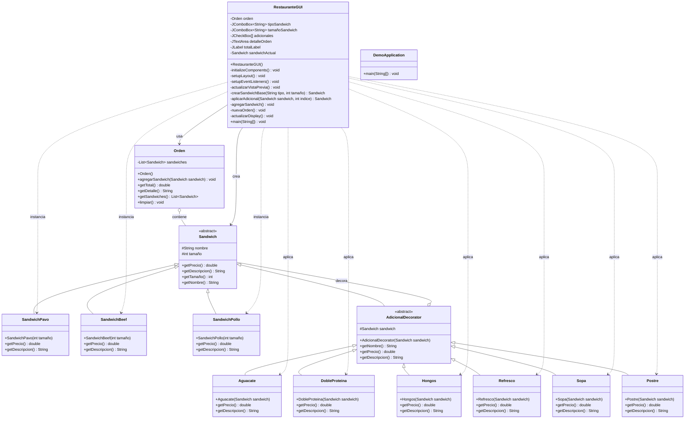

# Sistema de Pedidos de Restaurante - Patrón Decorator

## Descripción

Este proyecto es una aplicación Java que simula un sistema de pedidos para un restaurante. Permite a los usuarios seleccionar diferentes tipos de sándwiches y añadir "adicionales" como bebidas, postres, sopas e ingredientes extra, aplicando el patrón de diseño Decorator para una gestión flexible de los complementos. La aplicación cuenta con una interfaz gráfica de usuario (GUI) para facilitar la interacción.

## 🏛️ Diagrama de Clases



## Características

*   **Patrón Decorator:** Implementación del patrón de diseño Decorator para añadir funcionalidades (adicionales) a los sándwiches de forma dinámica.
*   **Interfaz Gráfica:** GUI intuitiva desarrollada con Java Swing.
*   **Gestión de Pedidos:** Sistema completo para crear, modificar y calcular el total de pedidos.
*   **Flexibilidad:** Posibilidad de combinar múltiples adicionales en un mismo sándwich.

## Instalación

1.  **Clonar el Repositorio:**
    ```bash
    git clone <URL_DEL_REPOSITORIO>
    cd <NOMBRE_DEL_REPOSITORIO>
    ```
2.  **Construir el Proyecto con Maven:**
    ```bash
    mvn clean install
    ```

## Uso

Para ejecutar la aplicación y utilizar la interfaz gráfica:

1.  **Compilar y Ejecutar:**
    ```bash
    mvn spring-boot:run
    ```
    Esto iniciará la aplicación y la GUI del restaurante debería aparecer en una nueva ventana.

## Estructura del Proyecto

*   `src/main/java/com/example/demo/`: Contiene el código fuente principal de la aplicación.
    *   `Sandwich.java`: Interfaz base para los sándwiches.
    *   `SandwichBeef.java`, `SandwichPavo.java`, `SandwichPollo.java`: Implementaciones concretas de sándwiches.
    *   `AdicionalDecorator.java`: Clase abstracta para los decoradores.
    *   `Refresco.java`, `Postre.java`, `Sopa.java`, `Aguacate.java`, `Hongos.java`, `DobleProteina.java`: Clases concretas de decoradores (adicionales).
    *   `Orden.java`: Clase para gestionar los detalles de una orden.
    *   `RestauranteGUI.java`: Clase principal que maneja la interfaz gráfica de usuario.
    *   `DemoApplication.java`: Clase principal de la aplicación Spring Boot.

*   `src/main/resources/`: Contiene recursos de la aplicación, como `application.properties`.
*   `src/test/java/com/example/demo/`: Contiene los tests unitarios.

## Tecnologías Utilizadas

*   **Java 11+**
*   **Spring Boot**
*   **Maven** para gestión de dependencias
*   **Java Swing** para la interfaz gráfica

## Funcionalidades

1.  **Selección de Sándwich Base:** Elige entre Pavo, Beef o Pollo
2.  **Selección de Tamaño:** 15 cm o 30 cm
3.  **Adicionales Disponibles:**
    *   Aguacate
    *   Doble Proteína
    *   Hongos
    *   Refresco
    *   Sopa
    *   Postre
4.  **Vista Previa en Tiempo Real:** Visualiza el pedido y precio mientras configuras
5.  **Gestión de Órdenes:** Agrega múltiples sándwiches a una orden
6.  **Cálculo Automático:** Total actualizado automáticamente

## Patrón Decorator en Acción

El patrón Decorator permite:
- **Extensibilidad:** Agregar nuevos adicionales sin modificar el código existente
- **Flexibilidad:** Combinar múltiples adicionales en cualquier orden
- **Responsabilidad Única:** Cada decorador tiene una única responsabilidad
- **Composición Dinámica:** Los adicionales se aplican en tiempo de ejecución

## Licencia

Este proyecto está bajo la Licencia MIT.
